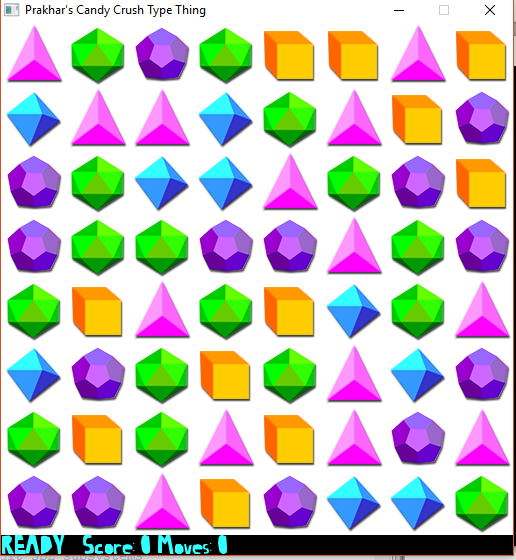
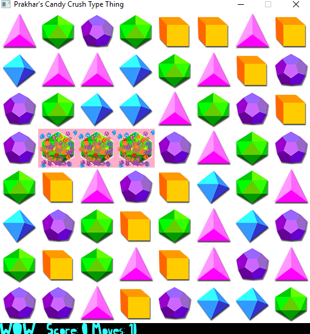

# A Candy Crush Style Game (C++/Windows)

(WARNING : Please ensure you have a working audio device to run this game, else game
may not launch).

### PLATFORM :
- Language : C++11
- Library Used : SDL2
- Extensions Used : SDL_ttf & SDL_mixer
- Compiler : MinGW

Developed in Windows 10 using CodeBlocks IDE. The source file is present as a CodeBlocks Project in folder “SOURCE”. The Game runs on Windows, tested on Windows 10.

### ARCHITECTURE:
- Class Grid contains the game board and the associated functionalities like checking a
valid move, finding horizontal/vertical matches, updating grid if a match occurs.
- Class Game has all the Graphics and Media component to run the game. It sets up
the graphics/media, draws the grid/text, plays sound.
The main.cpp file creates an object of Class Game and calls the function “game_main()”
which contains the main game loop.
Class Game creates an object of Class Grid and exposes the it in a graphical form to the
user.

### FEATURES :
- 8*8 grid with Vertical/Horizontal Matches.
- Cascaded Matches supported.
- Text and Sound enabled.
- Draw animation in case of a match.
- Mouse input supported.
- Implemented using two classes with no Global Variables or a single large source file.
- Class Game is built on top of Class Grid in a modular fashion. Each class resides in a separate file.
- Built using modern C++ features such as vectors, maps etc.
- Code is well documented.
- Tried to follow good programming ethics and OOPs principles.

### TO PLAY :
Simply click on GAME exe file.